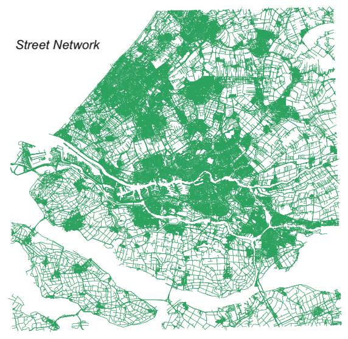
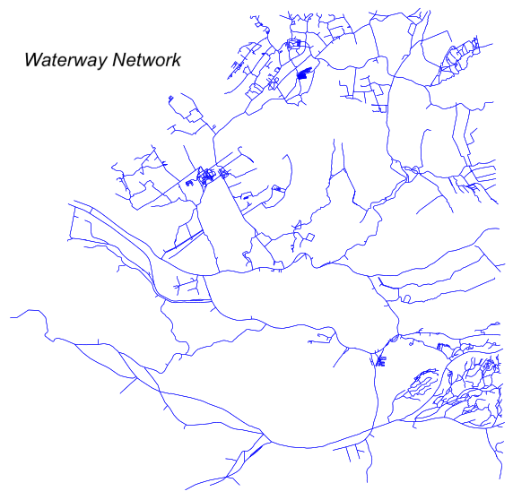
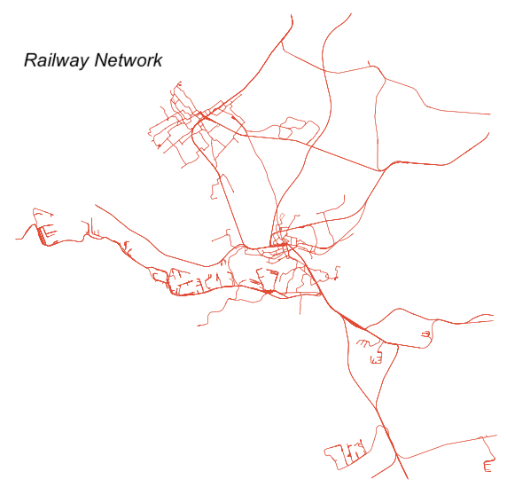

---
categories:
- research interests
comments: false
#date: "2016-10-02T22:55:05-04:00"
draft: false
showpagemeta: false
slug: ""
tags:
- research interests
title: Research Interests
---

My research synthesize the application of network science, data science, and urban economics to study the interaction between people and places. The broader aim is to characterize the presence of spatial and temporal signatures that dictate the spatiotemporal mixing process in urban mobility and transportation network.

The following queries reflect the research direction I'm interested in:
- How do socioeconomic attributes and geographic constraints affect the spatiotemporal process of individuals moving in urban spaces?
- How does socioeconomic status dictate response in individual mobility in the presence of external shock?
- How do human activity and urban structure shape the changing dynamics of stratified mobility flows?
- What are the effects of scale and location on economic diversity and its role in shaping urban dynamics?
- To what extent transport connectivity bridges the spatial inequality?
- How does the interlocking multimodal nature affect the robustness of urban transportation network?

