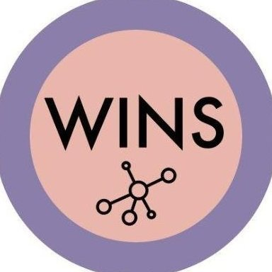

---
categories:
- scientific network
comments: false
#date: "2016-10-02T22:55:05-04:00"
draft: false
showpagemeta: false
slug: ""
tags:
- scientific network
title: Scientific Network
---

Complex System Society (CSS)

Women in Network Science (WiNS)

Method Excellence Network (MethodsNET)

European Studies in a Relational Universe/RELATE

